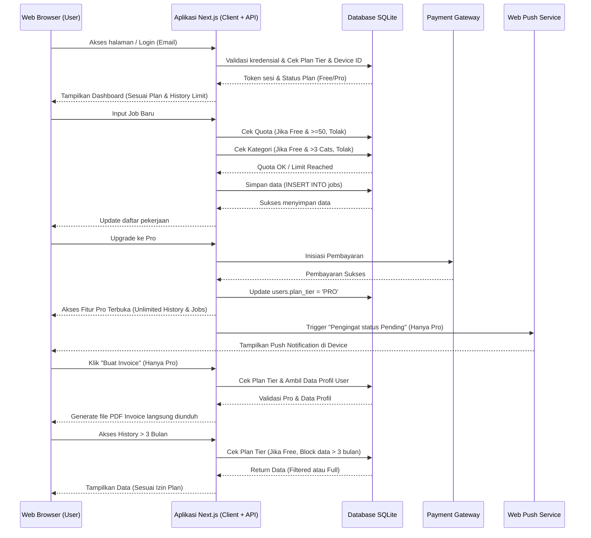
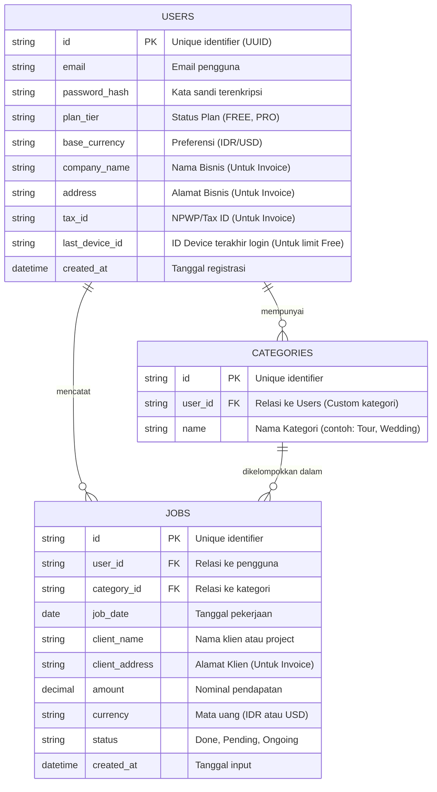

# PRD — Project Requirements Document

## 1. Overview
Banyak pekerja lepas (freelancer) perorangan mengalami kesulitan dalam melacak pekerjaan, memantau status pembayaran klien, dan menghitung total pendapatan bulanan secara rapi. Penggunaan spreadsheet manual seringkali merepotkan dan tidak memberikan wawasan visual yang instan. Selain itu, freelancer sering kesulitan membuat invoice profesional secara cepat untuk menagih pembayaran klien.

**Job Income Tracker** adalah sebuah aplikasi web (SaaS) dengan model **Freemium** yang dirancang khusus untuk freelancer perorangan. Aplikasi ini bertujuan membantu pengguna mencatat setiap pekerjaan, memantau status pengerjaan, mengelola pendapatan, serta melihat ringkasan performa finansial. Pengguna dapat memulai secara gratis dengan fitur terbatas untuk kebutuhan dasar, dan meningkatkan ke paket Pro untuk akses fitur lanjutan tanpa batas termasuk pembuatan invoice profesional, analitik mendalam, dan sinkronisasi multi-device.

## 2. Requirements
- **Platform:** Web Application (responsif untuk diakses via desktop maupun mobile).
- **Target Pengguna:** Freelancer perorangan profesional.
- **Model Bisnis:** Freemium (Paket Gratis terbatas & Paket Pro Berlangganan).
- **Harga Paket Pro:** Sekitar Rp 29.000 – Rp 49.000 per bulan.
- **Autentikasi:** Login dan Registrasi menggunakan Email dan Password.
- **Mata Uang:** 
  - Paket Gratis: Hanya Rupiah (IDR).
  - Paket Pro: Rupiah (IDR) dan US Dollar (USD) dengan konversi otomatis.
- **Notifikasi:** Khusus Paket Pro (Push Notification untuk pengingat status pending).
- **Batasan Penggunaan (Quota & Limit):**
  - **Paket Gratis:** 
    - Maksimal 50 input pekerjaan per bulan.
    - Maksimal 3 Kategori pekerjaan.
    - Riwayat data hanya 3 bulan terakhir.
    - Terbatas pada 1 Device aktif.
  - **Paket Pro:** 
    - Input pekerjaan tanpa batas (Unlimited).
    - Kategori tanpa batas (Unlimited Custom).
    - Riwayat data tanpa batas (Unlimited History).
    - Sinkronisasi Multi-device.
- **Fitur Invoice:**
  - Paket Gratis: Tidak tersedia.
  - Paket Pro: Dapat membuat dan mengunduh invoice profesional berdasarkan data pekerjaan.
- **Ekspor Laporan:** 
  - Paket Gratis: Hanya dapat mengunduh laporan format CSV (Basic).
  - Paket Pro: Dapat mengunduh laporan format PDF (Professional) dan CSV.

## 3. Core Features
- **Manajemen Pekerjaan (Job Management):** 
  - Fitur untuk menambah pekerjaan baru dengan detail: Tanggal, Nama Klien/Pekerjaan, Kategori, Nominal Pendapatan, dan Mata Uang.
  - *Paket Gratis:* Maksimal 50 job/bulan.
  - *Paket Pro:* Unlimited job.
- **Manajemen Kategori:** 
  - Pengelompokan pekerjaan berdasarkan jenis layanan.
  - *Paket Gratis:* Maksimal 3 kategori (misal: Foto, Video, Desain).
  - *Paket Pro:* Unlimited kategori custom.
- **Pelacakan Status (Status Tracking):** 
  - Pengguna dapat memperbarui status setiap pekerjaan menjadi *Done* (Selesai), *Pending* (Tertunda/Belum Dibayar), atau *Ongoing* (Dalam Pengerjaan).
  - *Paket Pro:* Dapatkan notifikasi pengingat otomatis untuk status *Pending*.
- **Dasbor Finansial (Dashboard):** 
  - Halaman utama ringkasan yang menampilkan total pendapatan.
  - *Paket Gratis:* Summary income bulanan saja (Angka dasar).
  - *Paket Pro:* Dashboard lengkap dengan grafik pertumbuhan, breakdown per kategori, dan tren bulanan/tahunan (Visualisasi Analitik).
- **Riwayat Data (Data History):** 
  - Akses terhadap data pekerjaan yang sudah lalu.
  - *Paket Gratis:* Hanya dapat mengakses data 3 bulan terakhir.
  - *Paket Pro:* Akses histori data unlimited (sejak awal registrasi).
- **Sinkronisasi Device (Device Sync):** 
  - Kemampuan akses akun dari berbagai perangkat.
  - *Paket Gratis:* Terkunci pada 1 User / 1 Device aktif.
  - *Paket Pro:* Multi-device sync (Bisa akses dari HP dan Laptop secara bergantian).
- **Sistem Filter & Sortir:** 
  - Kemampuan untuk memfilter daftar pekerjaan dan data dasbor berdasarkan Bulan (jangka waktu) dan Jenis/Kategori Pekerjaan.
- **Ekspor Laporan:** 
  - *Paket Gratis:* Hanya dapat mengunduh laporan format CSV.
  - *Paket Pro:* Dapat mengunduh laporan format PDF (untuk dibaca/dicetak) dan CSV.
- **Pembuatan Invoice (Invoice Generation):**
  - *Paket Gratis:* Tidak tersedia.
  - *Paket Pro:* Fitur untuk meng-generate invoice profesional dalam format PDF berdasarkan data pekerjaan yang dipilih. Invoice mencakup detail pekerja, detail klien, daftar item pekerjaan, total tagihan, dan tanggal jatuh tempo. Pengguna dapat menyesuaikan profil perusahaan mereka (Nama, Alamat, NPWP) untuk muncul di header invoice.
- **Konversi Mata Uang:** 
  - *Paket Gratis:* Tidak tersedia (IDR Only).
  - *Paket Pro:* Sistem yang dapat mengkonversi nilai USD ke Rupiah (atau sebaliknya) pada dasbor agar total pendapatan tetap memiliki satu standar perhitungan.
- **Manajemen Langganan:** 
  - Halaman untuk melihat status paket saat ini, melakukan upgrade ke Pro, dan mengelola pembayaran berlangganan.

## 4. User Flow
1. **Pendaftaran/Login:** Pengguna mendaftar menggunakan email pribadi dan mengatur kata sandi.
2. **Pemilihan Paket:** Setelah registrasi, pengguna dimulai dengan **Paket Gratis**. Opsi upgrade ke **Paket Pro** tersedia di menu pengaturan.
3. **Setup Awal:** 
   - *Gratis:* Pengguna memilih dari 3 kategori default yang tersedia.
   - *Pro:* Pengguna melengkapi profil perusahaan untuk kebutuhan invoice dan mengatur preferensi mata uang (IDR/USD).
4. **Melihat Dasbor:** Setelah login, pengguna melihat dasbor. 
   - *Gratis:* Hanya melihat ringkasan income bulan ini. Dataolder dari 3 bulan akan disembunyikan/diarsipkan.
   - *Pro:* Melihat grafik analitik lengkap dan seluruh riwayat data.
5. **Input Pekerjaan:** 
   - Pengguna menekan tombol "Tambah Job".
   - Sistem memvalidasi quota (Jika Gratis dan sudah 50 job bulan ini, muncul prompt upgrade).
   - Sistem memvalidasi kategori (Jika Gratis dan kategori sudah 3, pengguna harus menggunakan kategori existing).
   - Pengguna mengisi formulir: tanggal, nama klien, kategori, nominal, dan status awal.
6. **Pembaruan Status:** Saat pekerjaan selesai atau tagihan sudah dibayar klien, pengguna mengubah status. (Jika Pro, sistem dapat mengirim pengingat otomatis untuk job yang lama pending).
7. **Pembuatan Invoice (Khusus Pro):**
   - Pengguna memilih pekerjaan dengan status *Pending* atau *Done*.
   - Pengguna klik "Buat Invoice".
   - Sistem menarik data profil pengguna dan detail pekerjaan.
   - Pengguna mengunduh file PDF invoice untuk dikirim ke klien.
8. **Melihat Laporan & Analitik:** 
   - Pengguna masuk ke menu laporan.
   - *Pro:* Dapat melihat grafik analitik mendalam, tren tahunan, dan melakukan konversi valuta asing.
   - *Gratis:* Hanya melihat ringkasan tabel bulan berjalan.
9. **Ekspor Data:** 
   - Pengguna mengklik tombol "Ekspor".
   - *Gratis:* Opsi hanya CSV.
   - *Pro:* Opsi PDF (Laporan) dan CSV.
10. **Sinkronisasi Device:** 
    - *Gratis:* Jika login di device baru, session di device lama mungkin terminated atau dibatasi.
    - *Pro:* Login bebas di berbagai device dengan data tersinkronisasi real-time.
11. **Upgrade Paket:** Jika pengguna Gratis mencapai batas limit (50 job, 3 kategori, butuh history >3 bulan) atau membutuhkan fitur Pro (seperti Invoice), pengguna masuk ke halaman Pricing, melakukan pembayaran (Rp 29k-49k), dan status akun berubah menjadi Pro secara instan.

## 5. Architecture
Aplikasi ini menggunakan arsitektur *Monolithic* modern (Fullstack Web Framework) di mana antarmuka pengguna (Frontend) dan logika server (Backend) berada dalam satu kesatuan kode. Klien (Browser Web) berkomunikasi langsung dengan server melalui rute API. Server kemudian mengelola proses membaca dan menyimpan data ke dalam Database. 

Terdapat lapisan *Middleware* atau *Logic Check* pada server untuk memvalidasi status langganan pengguna (Free vs Pro) sebelum mengizinkan akses fitur tertentu. Validasi ini mencakup: cek quota job (50 vs Unlimited), cek jumlah kategori (3 vs Unlimited), cek rentang waktu history (3 bulan vs Unlimited), dan cek session device (1 vs Multi). Layanan pihak ketiga digunakan untuk Payment Gateway, Push Notification, dan cek nilai tukar mata uang.

## 6. Database Schema
Aplikasi ini membutuhkan struktur database relasional yang sederhana namun efektif untuk mengelola pengguna skala SaaS, pekerjaan mereka, dan status langganan. Untuk mendukung fitur invoice, tabel pengguna diperluas untuk menyimpan detail profil bisnis. Indeksing pada tabel `jobs` diperlukan untuk mempercepat query berdasarkan tanggal (guna membatasi history 3 bulan untuk pengguna Gratis).

**Daftar Tabel Utama:**
1. `users`: Menyimpan profil, kredensial pengguna, status langganan (Free/Pro), preferensi mata uang, detail profil bisnis untuk invoice, dan informasi device terakhir (untuk limitasi 1 device pada Free).
2. `categories`: Menyimpan jenis-jenis pekerjaan (opsi default atau kustom dari user).
3. `jobs`: Entitas utama untuk mencatat setiap pekerjaan yang dilakukan oleh freelancer beserta status dan nominal uangnya.
4. `subscriptions`: (Opsional/Terkait Users) Menyimpan riwayat transaksi pembayaran langganan.

## 7. Tech Stack
Berikut adalah rekomendasi teknologi untuk pengembangan *Job Income Tracker* agar proses *development* cepat, aman, dan efisien untuk SaaS berbasis web dengan model Freemium:

- **Frontend & Backend (Fullstack Framework):** Next.js (App Router)
- **Komponen Visual & Styling:** Tailwind CSS dipadukan dengan shadcn/ui untuk tampilan antarmuka yang modern, responsif, dan rapi secara instan.
- **Database Relasional:** SQLite (sangat ringan dan cocok untuk struktur proyek awal yang berbasis file, performa dapat diandalkan).
- **Database ORM:** Drizzle ORM (interaksi yang sangat cepat dan aman dengan SQLite).
- **Sistem Autentikasi:** Better Auth (mudah dikonfigurasi untuk menangani login email/password, session management, dan device tracking).
- **Payment Gateway:** Midtrans atau Stripe (untuk memproses pembayaran langganan Paket Pro).
- **Library Tambahan Core Features:**
  - **Grafik/Chart:** Recharts (khusus untuk Paket Pro visualisasi pendapatan bulanan, tren tahunan, dan breakdown kategori).
  - **Sistem Ekspor & Invoice:** `@react-pdf/renderer` (khusus Paket Pro untuk menghasilkan Laporan PDF dan Invoice Profesional yang dapat dikustomisasi).
  - **Ekspor CSV:** `react-csv` (Semua Paket).
  - **Konversi & Notifikasi:** API Pihak ketiga gratis (seperti ExchangeRate-API) untuk konversi mata uang dinamis (Pro), dan Web Push API standar untuk notifikasi browser (Pro).
  - **Date Handling:** `date-fns` (Untuk memfilter query history 3 bulan vs Unlimited dengan efisien).